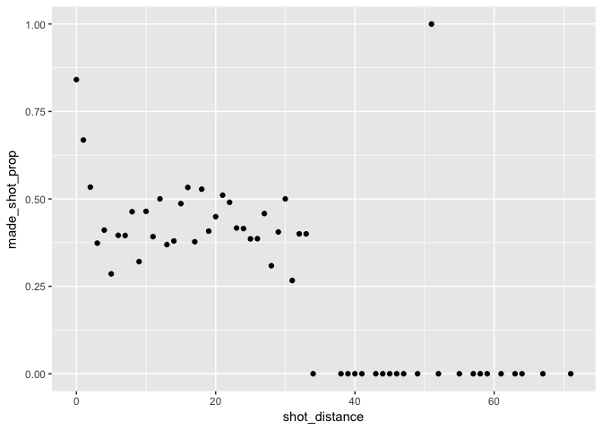
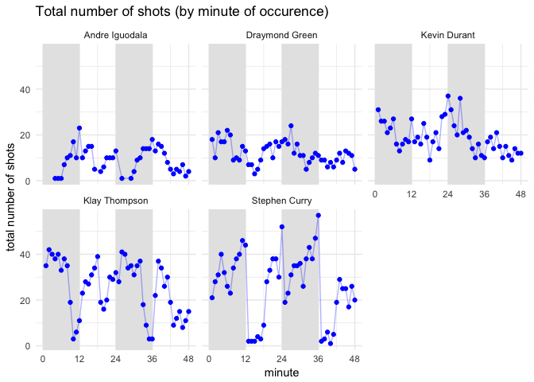

HW 02 - Shot Charts
================
Nancy Rose

Data
====

##### Download data for

-   andre-iguodala.csv
-   draymond-green.csv
-   kevin-durant.csv
-   klay-thompson.csv
-   stephen-curry.csv

Data Dictionary
===============

See data-dictionary.md

Data Preparation
================

See make-shots-data-script.R

Shot Charts
===========

See make-shots-chart-script.R

Summary Tables
==============

``` r
shots_data <- read.csv("../data/shots-data.csv")

#total shots by player
shots_data %>%
  group_by(player_name) %>%
  select(player_name) %>%
  summarize(total=n()) %>%
  arrange(desc(total))
```

    ## # A tibble: 5 x 2
    ##   player_name    total
    ##   <fct>          <int>
    ## 1 Stephen Curry   1250
    ## 2 Klay Thompson   1220
    ## 3 Kevin Durant     915
    ## 4 Draymond Green   578
    ## 5 Andre Iguodala   371

``` r
#effective shooting percentage

##effective shooting % by player
shots_data %>%
  group_by(player_name) %>%
  summarize(total=n(), made=sum(shot_made_flag=='made shot'), perc_made=made/total)%>%
  arrange(desc(perc_made))
```

    ## # A tibble: 5 x 4
    ##   player_name    total  made perc_made
    ##   <fct>          <int> <int>     <dbl>
    ## 1 Kevin Durant     915   495     0.541
    ## 2 Andre Iguodala   371   192     0.518
    ## 3 Klay Thompson   1220   575     0.471
    ## 4 Stephen Curry   1250   584     0.467
    ## 5 Draymond Green   578   245     0.424

``` r
## 2PT effective shooting % by player
shots_data %>%
  group_by(player_name) %>%
  filter(shot_type=='2PT Field Goal') %>%
  summarize(total=n(), made=sum(shot_made_flag=='made shot'), perc_made=made/total)%>%
  arrange(desc(perc_made))
```

    ## # A tibble: 5 x 4
    ##   player_name    total  made perc_made
    ##   <fct>          <int> <int>     <dbl>
    ## 1 Andre Iguodala   210   134     0.638
    ## 2 Kevin Durant     643   390     0.607
    ## 3 Stephen Curry    563   304     0.540
    ## 4 Klay Thompson    640   329     0.514
    ## 5 Draymond Green   346   171     0.494

``` r
## 3PT effective shooting % by player
shots_data %>%
  group_by(player_name) %>%
  filter(shot_type=='3PT Field Goal') %>%
  summarize(total=n(), made=sum(shot_made_flag=='made shot'), perc_made=made/total)%>%
  arrange(desc(perc_made))
```

    ## # A tibble: 5 x 4
    ##   player_name    total  made perc_made
    ##   <fct>          <int> <int>     <dbl>
    ## 1 Klay Thompson    580   246     0.424
    ## 2 Stephen Curry    687   280     0.408
    ## 3 Kevin Durant     272   105     0.386
    ## 4 Andre Iguodala   161    58     0.360
    ## 5 Draymond Green   232    74     0.319

Shooting Distance
=================

``` r
#dplyr table
shots_dplyr <- shots_data %>%
  arrange(shot_distance) %>%
  group_by(shot_distance) %>%
  summarize(made_shot_prop=sum(shot_made_flag=='made shot')/n())

#ggplot
ggplot(data=shots_dplyr, aes(x=shot_distance, y=made_shot_prop))+geom_point()
```



``` r
# What do you observe?
#At 0ft, most shots were made. As the distance goes increases to 3ft, the proportion of shots made drops quickly to 45%. From 3ft to 35ft, the proportion remains loosly around 45%, with a range from 25% to 50%. After 35ft, no shots were made, except for one shot at 51ft.

# Can you confirm that the shorter the distance, the more effective the shots?
#Shots will only be more effective within the first 3 ft. After 3ft, distance does not matter much in determining whether you will get the shot or not.

# Can you guesstimate a distance threshold beyond which the chance of making a successful shot is basically null?
#Around 35ft.

# What distances tend to have a percentage (of making a shot) of 50% or more?
# 1, 2, 3, 16, 18, 21, 51 ft.
```

Total Number of Shots by Minute of Occurence
============================================

``` r
shots_data_occ <- shots_data %>%
  group_by(player_name, minute) %>%
  summarize(shots_made=n())

ggplot(data=shots_data_occ, aes(x=minute, y=shots_made))+
  ggtitle(label='Total number of shots (by minute of occurence)')+
  scale_x_continuous(limits=c(0,48))+
  labs(y='total number of shots')+
  facet_wrap(~player_name)+
  geom_rect(aes(xmin=0, xmax=12, ymin=-Inf, ymax=Inf), fill='grey90')+
  geom_rect(aes(xmin=24, xmax=36, ymin=-Inf, ymax=Inf), fill='grey90')+
  geom_point(color="blue")+
  geom_path(color="blue", alpha=0.3)+
  scale_x_continuous(breaks=c(0,12,24,36,48))+
  theme_minimal()
```

    ## Scale for 'x' is already present. Adding another scale for 'x', which
    ## will replace the existing scale.


